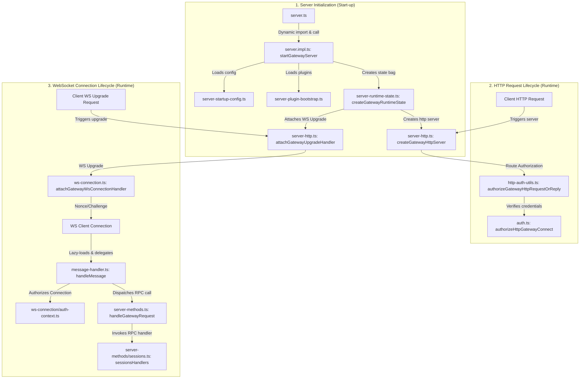

# Day 3 — Gateway Server & WebSocket Protocol

**Goal:** Understand how the HTTP server, WebSocket server, and RPC message dispatch
work. This is the networking core of OpenClaw and maps directly to standard
Node.js backend patterns.

---

## Concept: HTTP + WebSocket on a single port

Traditional REST APIs use HTTP request/response. OpenClaw also needs *real-time*
bidirectional communication (e.g. streaming agent replies to the browser). It achieves
this by upgrading HTTP connections to WebSocket on the same port (18789).

```
Browser → HTTP GET /              → serve control UI HTML
Browser → HTTP GET /api/health    → REST health check
Browser → WebSocket ws://...      → real-time RPC + event stream
```

The `ws` library intercepts the HTTP `Upgrade: websocket` header and hands off to
the WS handler, while the HTTP server handles regular requests.

The gateway HTTP server is built **directly on Node's native `node:http` / `node:https`
modules** (see `src/gateway/server-http.ts`), not on a web framework. There is no
`app.use()` middleware chain — request routing and auth are done by hand inside the
request handler. Every "framework" concept below is implemented from first principles
here, which actually makes it *better* study material.

---

## Concept: JSON-RPC pattern

OpenClaw's WebSocket uses a *request/response* pattern over the socket:

**Client sends:**
```json
{ "id": "abc123", "method": "sessions.list", "params": {} }
```
**Server replies:**
```json
{ "id": "abc123", "result": [...] }
```
**Server pushes events (no id):**
```json
{ "type": "event", "name": "chat.message", "payload": {...} }
```

This is the same pattern as JSON-RPC 2.0, Language Server Protocol, and many other
developer tools. Understanding it here transfers directly.

---

## File Sequence

### Step 1 — The public surface
**File:** `src/gateway/server.ts`

This is the *facade* — a thin file that exports only what callers need:
```typescript
export { truncateCloseReason } from './server/close-reason.js';
export type { GatewayServer, GatewayServerOptions } from './server.impl.js';

export async function startGatewayServer(...) { /* delegates to server.impl.ts */ }
```
(`startGatewayServer` is defined in `server.ts` at ~line 24 and delegates into the
implementation in `server.impl.ts`.)

**Why does this pattern exist?** It hides internal implementation details behind a
stable API. Callers import from `server.ts`, not from `server.impl.ts`. If the
implementation moves, only `server.ts` needs updating.

---

### Step 2 — Server initialisation
**File:** `src/gateway/server.impl.ts` — `startGatewayServer()` at **line 531**

`startGatewayServer()` is a long async function. Read it in phases (line numbers are
approximate — the function is large, so navigate by the log lines):

**Step-by-Step Execution Phases:**
*   **Bootstrap & Preflight (Lines 535–560):** Registers environment options, initializes the network runtime, and checks if a server restart was requested by loading process-level telemetry (the "restart handoff" context).
*   **Config & Secret Activation (Lines 567–614):** Dynamically imports and reads the `openclaw.json` configuration file, validates authorization rules, overrides values based on startup options, and triggers the loading of stored secrets.
*   **Plugin Registry Initialization (Lines 657–710):** Discovers all enabled channel and runtime plugins and generates a plugin lookup table to map available plugin hooks.
*   **HTTP & WebSocket Server Binding (Lines 870–899):** Builds the server runtime state, starts the raw TCP/HTTP listener, and attaches the WebSocket server (`ws`) to intercept upgrade requests on the same port.
*   **Services & Loop Scheduling (Lines 1468–1680):** Registers database session stores, starts background services (like the cron runner and update checker), and starts the channel health monitor loop.
*   **Returns a Controller:** Returns an object containing the `close` function to gracefully shutdown the server.

**Key Concepts to Note:**

**Resolve & validate:** load config snapshot, run legacy migration, validate.

**Plugins:** create plugin registry, load plugin runtime. Notice the pattern:
```typescript
const pluginRuntime = await createPluginRuntime(config, ...);
```
The server doesn't know which plugins will be loaded — it calls a factory that
figures it out from config. This is *dependency injection* via factory functions.

**HTTP server:** create the native `http.Server` (see `src/gateway/server-http.ts`,
which calls `createServer` from `node:http`). There is no framework app object — the
request handler is a plain `(req, res) => {...}` function.

**WebSocket:** create `WebSocketServer` from the `ws` library and attach it to the
same native HTTP server (it listens for the `upgrade` event).

**Line 847:** `log.info("starting HTTP server...")` — the log line you recognise.

**Ready:** once listening, `src/gateway/server-startup-log.ts` (~line 56) logs the
ready line — **`http server listening (N plugins: …)`**. `formatReadyDetails()` at
~line 152 builds the plugin summary.

---

### Step 3 — WebSocket connection lifecycle
**Files:** `src/gateway/server/ws-connection.ts` and `src/gateway/server/ws-connection/message-handler.ts`

This is the most important flow for understanding real-time communication.

**Connection lifecycle:**
1. **Client opens TCP connection:** Node's native HTTP/S server listens for connection.
   * *File/Line:* `src/gateway/server-http.ts` at line ~517 (HTTPS) and ~521 (HTTP)
2. **HTTP Upgrade handshake:** Server intercepts upgrade, checks proxy status, and hands off to WebSocket (`wss`).
   * *File/Line:* `src/gateway/server-http.ts` lines ~843–964
3. **Preauth timer starts:** A timeout guard begins to protect the gateway from resource exhaustion by unauthenticated sockets.
   * *File/Line:* `src/gateway/server/ws-connection.ts` lines ~433–448 (using `setTimeout`)
4. **Server sends a nonce (challenge) event:** Server pushes a `connect.challenge` frame with a random nonce.
   * *File/Line:* `src/gateway/server/ws-connection.ts` lines ~313–318
5. **Client responds with a connect request frame:** Client responds with auth credentials (token, password, etc.).
   * *File/Line:* `src/gateway/server/ws-connection/message-handler.ts` lines ~441–530
6. **Connection is authorized, timer cancelled, client promoted:** Credentials verified, timeout cleared (`clearHandshakeTimer`), and client metadata registered.
   * *File/Line:* `src/gateway/server/ws-connection/message-handler.ts` lines ~1558–1590
7. **Normal message flow begins:** Subsequent frames skip connect checks and route directly to method handlers.
   * *File/Line:* `src/gateway/server/ws-connection/message-handler.ts` lines ~1784–1873

**What happens when auth fails:**
- Timer fires → `handshake-timeout` logged → `close()` called
- This produces the `[ws] handshake timeout` log.

**On-Demand Message Handling:**
For efficiency, the gateway lazily loads the heavy message handling module (`ws-connection/message-handler.ts`) on demand when the first message is received, queueing any early frames in the meantime.

Once loaded, the message handler registers its main message listener:
```typescript
// Inside ws-connection/message-handler.ts:
socket.on("message", (data) => {
  // 1. Parses raw JSON frame
  const parsed = JSON.parse(rawDataToString(data));
  
  // 2. Extracts type, method, and id metadata
  
  // 3. Delegates the request to handleGatewayRequest in server-methods.ts:
  await handleGatewayRequest({
    req,
    respond,
    client,
    extraHandlers,
    methodRegistry: getMethodRegistry(),
    context: buildRequestContext()
  });
});
```

---

### Step 4 — RPC method handlers
**File:** `src/gateway/server-methods/sessions.ts`

Each file handles a group of related RPC methods. The method handlers are grouped together in a registry object:

```typescript
// Inside src/gateway/server-methods/sessions.ts:
export const sessionsHandlers: GatewayRequestHandlers = {
  "sessions.list": async ({ params, respond, context }) => {
    if (!assertValidParams(params, validateSessionsListParams, "sessions.list", respond)) {
      return;
    }
    const cfg = context.getRuntimeConfig();
    const payload = await measureDiagnosticsTimelineSpan("gateway.sessions.list", async () => {
      // 1. Loads session databases:
      const { storePath, store } = loadCombinedSessionStoreForGateway(cfg, { agentId: params.agentId });
      
      // 2. Fetch configurations and list sessions:
      const modelCatalog = await loadOptionalSessionsListModelCatalog(context);
      const result = await listSessionsFromStoreAsync({ cfg, storePath, store, modelCatalog, opts: params });
      
      // 3. Flag sessions with active runs:
      const activeSessionKeys = collectTrackedActiveSessionRunKeys(context);
      const sessions = result.sessions.map((session) =>
        Object.assign({}, session, { hasActiveRun: activeSessionKeys.has(session.key) })
      );
      
      return { ...result, sessions };
    });
    
    // 4. Returns response:
    respond(true, payload, undefined);
  },
  
  // other sessions.* handlers...
};
```

`GatewayRequestContext` is the dependency bag — it gives handlers access to config,
session store, channel manager, cron service, without those being global variables.
This is the *service locator* pattern.

---

### Step 5 — Health monitor
**File:** `src/gateway/channel-health-monitor.ts` (full file, ~210 lines)

This is small enough to read completely. Pay attention to:

**The main check runner loop (`startChannelHealthMonitor`):**
```typescript
// Inside src/gateway/channel-health-monitor.ts:
export function startChannelHealthMonitor(deps: ChannelHealthMonitorDeps): ChannelHealthMonitor {
  // ...
  async function runCheck() {
    // ...
    const snapshot = channelManager.getRuntimeSnapshot();

    for (const [channelId, accounts] of Object.entries(snapshot.channelAccounts)) {
      for (const [accountId, status] of Object.entries(accounts)) {
        // ...
        const health = evaluateChannelHealth(status, healthPolicy);
        if (health.healthy) {
          continue;
        }
        
        // Restart the unhealthy channel:
        if (status.running) {
          await channelManager.stopChannel(channelId as ChannelId, accountId, { manual: false });
        }
        channelManager.resetRestartAttempts(channelId as ChannelId, accountId);
        await channelManager.startChannel(channelId as ChannelId, accountId);
      }
    }
  }

  // Registers check interval loop:
  timer = setInterval(() => void runCheck(), checkIntervalMs);
  
  return { stop };
}
```

**`setInterval`** — schedules a callback to run repeatedly. This is how periodic
background tasks work in Node.js without threads.

**`evaluateChannelHealth()`** is in `channel-health-policy.ts` — read that next.
It returns reasons like `"stale-socket"`, `"disconnected"`, `"stopped"`.

---

### Step 6 — Server runtime state
**File:** `src/gateway/server-runtime-state.ts`

This file defines the "state bag" that holds all live runtime objects:
- The HTTP server instance
- The WebSocket server instance
- The channel manager
- Connected WS clients (a `Set<GatewayWsClient>` — created here, line 130)
- The cron service reference
- The control-UI / canvas host wiring (served via `src/gateway/control-ui.ts`)

*(Note: The MCP loopback server is started **lazily** (on first use) rather than eagerly at boot — see the separate file `src/gateway/mcp-http.ts`.)*

**TypeScript concept:** The function that constructs this state is defined in `server-runtime-state.ts` and returns a promised object containing all live connections and handlers:
```typescript
// Inside src/gateway/server-runtime-state.ts:
export async function createGatewayRuntimeState(params: {
  cfg: OpenClawConfig;
  bindHost: string;
  port: number;
  controlUiEnabled: boolean;
  // ...other inputs
}): Promise<{
  releasePluginRouteRegistry: () => void;
  httpServer: HttpServer;
  wss: WebSocketServer;
  clients: Set<GatewayWsClient>;
  // ...other live state properties
}>
```
Both the input parameter object and the returned resolved object are explicitly typed, ensuring that other bootstrapping layers (like `server.impl.ts`) always interact with valid runtime structures.

---

### Step 7 — Auth (hand-rolled, no middleware framework)
**Files:** `src/gateway/auth.ts` and `src/gateway/http-auth-utils.ts`

Because there is no third-party web framework, there is no generic `app.use()` middleware chain. Instead, cross-cutting concerns like authentication are resolved imperatively by helper modules before requests hit their endpoints.

For HTTP routes, authentication is handled by the following wrapper:
```typescript
// Inside src/gateway/http-auth-utils.ts:
export async function authorizeGatewayHttpRequestOrReply(params: {
  req: IncomingMessage;
  res: ServerResponse;
  auth: ResolvedGatewayAuth;
  // ...
}): Promise<AuthorizedGatewayHttpRequest | null> {
  // 1. Validates request headers (Origin, Host, Bearer Token)
  const result = await checkGatewayHttpRequestAuth(params);
  
  // 2. If validation fails, writes the HTTP 401 or 429 response:
  if (!result.ok) {
    sendGatewayAuthFailure(params.res, result.authResult);
    return null;
  }
  
  // 3. If validation succeeds, returns client scopes/role info:
  return result.requestAuth;
}
```

Under the hood, `checkGatewayHttpRequestAuth` invokes `authorizeHttpGatewayConnect` from `src/gateway/auth.ts`. This inspects the token/password credentials, checks Tailscale/trusted-proxy headers, rate-limits brute force attempts, and checks if local loopback connections should bypass auth.

#### Gateway Calling Hierarchy Workflow



**Interview talking point:** "Because we build on Node's native `http` module rather than a heavyweight framework, request handling flows through a clear list of explicit stages. Authentication checks are invoked imperatively using clean helper utilities instead of being hidden behind an implicit middleware configuration — making the security boundaries easy to follow, audit, and unit test."

---

## TypeScript Patterns Introduced Today

| Pattern | Example | Meaning |
|---------|---------|---------|
| Async factory function | `startGatewayServer(): Promise<GatewayServer>` | Returns a live server object |
| Discriminated union | `{ type: 'event' } \| { type: 'response' }` | Type-safe message variants |
| `Set<T>` | `Set<GatewayWsClient>` | Unique collection of typed items |
| Native `http` handler | `(req, res) => {...}` in server-http.ts | Framework-free request handling |
| `interface` extends | `GatewayServer extends EventEmitter` | Inherit another type's shape |

---

## Key Questions for Day 3

1. How does a single TCP port (18789) serve both HTTP and WebSocket simultaneously?
2. What is the 10-second handshake timeout protecting against?
3. When the UI sends `sessions.list`, trace the exact path: WS message → handler →
   response. Name every function and file involved.
4. Why does the health monitor use `setInterval` instead of a loop with `await sleep()`?
   (Hint: think about what blocks the Node.js event loop.)
5. What is `GatewayRequestContext` and why is it passed to every method handler instead
   of using global variables?

---

## Exercise

While OpenClaw is running, open the browser DevTools (F12) → Network → WS.
Reload the UI and watch the WebSocket frames. You will see the JSON-RPC messages
going back and forth. Compare what you see to the handler code in
`src/gateway/server-methods/sessions.ts`.
