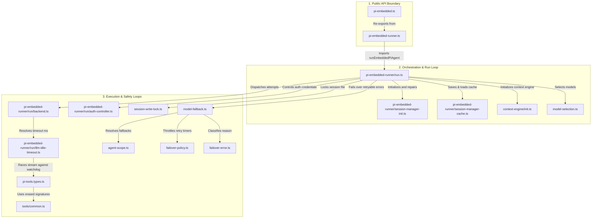

# Day 4 — Agent & LLM System

**Goal:** Understand how a single conversation turn works end-to-end — from a WhatsApp
inbound message arriving at the gateway, through model selection and fallback, to the
LLM response being delivered back. This is the business logic core of OpenClaw.

---

## Concept: The "embedded agent" model

OpenClaw runs LLM agents *inside the gateway process* (hence "embedded"). An agent
is just a loop:
1. Build a prompt (system prompt + conversation history)
2. Call the LLM API (streaming)
3. If the model returns a tool call, execute it and loop back
4. If the model returns text, deliver it and stop

The "Pi" prefix (Pi-agent, Pi-embedded) is the internal code name for this agent engine.

---

## Concept: Lanes

Because multiple conversations can happen simultaneously (WhatsApp + cron jobs + direct
chat), the gateway assigns each to a *lane* — a named async execution slot.
Lane names appear in your logs:
```
lane=session:agent:main:cron:f7a3eb68...   ← a cron job turn
lane=session:agent:main:main               ← the main chat lane
lane=nested                                ← a subagent spawned by the main agent
```

Lanes prevent one conversation from blocking another. They are managed in
`src/gateway/server-lanes.ts`.

---

## File Sequence

### Step 1 — The public API of the agent
**File:** `src/agents/pi-embedded.ts`

This file serves as a **clean barrel file (entry point facade)**. It does not implement the functions directly; instead, it re-exports types and functions from `pi-embedded-runner.js`:

```typescript
// Types re-exported (e.g. for telemetry, results, and metadata)
export type {
  EmbeddedAgentRunResult,
  EmbeddedPiRunResult, // Legacy compatibility name
  // ...
} from "./pi-embedded-runner.js";

// Functions re-exported to interact with the embedded agent
export {
  runEmbeddedAgent,
  runEmbeddedPiAgent, // Legacy compatibility alias
  queueEmbeddedAgentMessage,
  queueEmbeddedPiMessage,
  abortEmbeddedAgentRun,
  abortEmbeddedPiRun,
  isEmbeddedAgentRunActive,
  isEmbeddedPiRunActive,
  compactEmbeddedAgentSession,
  compactEmbeddedPiSession,
} from "./pi-embedded-runner.js";
```

#### Key Architecture Concepts:
1. **Barrel/Facade Pattern:** Everything interacting with the agent calls through these exported functions, keeping the actual complex orchestration isolated in `src/agents/pi-embedded-runner/`.
2. **Type-Safe Re-exports (`export type { ... }`):** Prevents runtime circular dependencies by explicitly indicating they are only types, which are fully stripped during compilation.
3. **Transition to Plugin-Agnostic Core:** Legacy "Pi"-prefixed naming (`runEmbeddedPiAgent`) is being phased out. The new, clean naming (`runEmbeddedAgent`) is aliased as a compatibility bridge so that external plugin callers remain unaffected while the core transitions to generic terminology.

**`sessionKey`** (or `sessionId`) is the unique identifier for a conversation (e.g. a WhatsApp thread). All state for that conversation (history, model overrides, active runs) is keyed by it.

---

### Step 2 — A conversation turn
**File:** `src/agents/pi-embedded-runner/run.ts`

This is the orchestrator for a single turn. Read it top to bottom:

**Phase 1 — Resolve config & Initialize (lines ~406–1280):**
- Loads the workspace directories and active session context.
- Resolves dynamic model configurations (`resolveModelAsync`) and loads core settings.
- Initializes auth profiles and runs initial checks (`createEmbeddedRunAuthController`).
- Sets up and connects the active `contextEngine` to manage prompt token budgets and state.

**Phase 2 — Execute & Recover Loop (lines ~1280–2684):**
- Operates inside a robust `while (true)` retry loop to handle transient errors.
- Prepares prompt variants and builds the runtime plan (`buildAgentRuntimePlan`).
- Dispatches and executes the model call via `runEmbeddedAttemptWithBackend` (which manages actual streaming and tool executions).
- Dynamically manages auto-compaction and truncation when context overflows or timeouts occur (lines ~1713–2160).
- Automatically rotates through auth profiles on token or provider failures.

**Phase 3 — Deliver & Finalize (lines ~2684–end):**
- Compiles the final multi-part output payloads (`buildEmbeddedRunPayloads`).
- Records complete execution telemetry (such as `usageAccumulator` details) and saves metadata to the session history.
- Returns the final turn response object containing payloads, duration, and telemetry metadata.

---

### Step 3 — Model fallback chain
**File:** `src/agents/model-fallback.ts` (full file)

This is one of the most important files to understand — it is what saved your gateway
from crashing when a model was unavailable.

**The real-world fallback loop:**
Rather than a naive `try/catch` block, `model-fallback.ts` utilizes the robust **`runWithModelFallback`** executor. Here is a high-level summary of how the real fallback orchestrator operates:

```typescript
export async function runWithModelFallback<T>(params: { ... }): Promise<ModelFallbackRunResult<T>> {
  // 1. Resolve primary & fallback candidates
  const candidates = resolveFallbackCandidates({ ... });
  const attempts: FallbackAttempt[] = [];

  for (let i = 0; i < candidates.length; i += 1) {
    const candidate = candidates[i];

    // 2. Manage Cooldowns & Throttle Probes
    const decision = resolveCooldownDecision({ ... });
    if (decision.type === "suspend_lanes" || decision.type === "skip") {
      attempts.push({ ... }); // Record skip
      continue; // Skip trying this model entirely
    }

    // 3. Execute Attempt
    const attemptRun = await runFallbackAttempt({ ... });

    if ("success" in attemptRun) {
      return attemptRun.success; // Found a working model!
    }

    // 4. Handle Errors & Fast-abort Non-retryables
    const err = attemptRun.error;
    
    if (isNonProviderRuntimeCoordinationError(err) || isLikelyContextOverflowError(errMessage)) {
      throw err; // Fast-abort: do not burn subsequent candidates on local engine/budget issues
    }

    if (err instanceof LiveSessionModelSwitchError) {
      // Dynamic Redirect: Jump straight to the new user-selected candidate in the array
      const targetIndex = findLiveSessionModelSwitchRedirectIndex({ error: err, candidates, currentIndex: i });
      if (targetIndex !== null) {
        i = targetIndex - 1;
        continue;
      }
    }

    // Record failover attempt & continue to next candidate
    attempts.push({ provider: candidate.provider, model: candidate.model, error: err });
  }

  // 5. All candidates exhausted
  throwFallbackFailureSummary({ attempts, candidates });
}
```

### Core Robustness Concepts in `model-fallback.ts`:

1. **Cooldown & Probing (`resolveCooldownDecision`):**
   When all auth profiles for a provider are in cooldown (e.g. from repeated rate-limits), the orchestrator intelligently decides whether to completely **skip** the candidate, **suspend** the execution lanes (preventing spam), or **probe** the provider (allowing a single, throttled query near cooldown expiration to see if service has restored).
2. **Fast-Abort Safety Valves:**
   Not all errors should trigger fallback. Local engine coordination errors (like session write-lock contention) or context overflow errors (which need to be handled by prompt compaction) bypass the fallback loop entirely and throw immediately to avoid draining other healthy candidates.
3. **Dynamic Model Switching (`LiveSessionModelSwitchError`):**
   If a model switch is requested mid-run, the fallback chain dynamically redirects the loop counter (`i`) to jump straight to the newly chosen model.
4. **`FallbackSummaryError`:**
   If all fallback candidates are exhausted, a unified error is thrown which details every single attempt's failure reason (timeout, model-not-found, overload, etc.) so that descriptive feedback can be rendered to the user.

**Interview talking point:** "OpenClaw's model fallback goes far beyond basic exception catching. It coordinates live state via dynamic auth-profile cooldown tracking, throttled candidate probing, and fast-abort safety valves that protect healthy models from being exhausted by localized execution failures."

---

### Step 4 — LLM idle timeout
**File:** `src/agents/pi-embedded-runner/run/llm-idle-timeout.ts`
**Default constant:** `src/config/agent-timeout-defaults.ts`

Rather than a generic `Promise.race()` using raw sleeps, the watchdog wrapper dynamically resolves configured limits and intercepts the asynchronous stream function:

```typescript
// 1. Dynamic Timeout Resolution
export function resolveLlmIdleTimeoutMs(params?: { ... }): number {
  // Checks run timeout, global agent defaults, and provider explicit configs.
  // Special Guard: Auto-disables watchdog (returns 0) for local providers (localhost, *.local, private IPs)
  // because local evaluation of prompts & thinking blocks can legitimately take minutes.
}

// 2. Stream Wrapping
export function streamWithIdleTimeout(baseFn: StreamFn, timeoutMs: number, ...): StreamFn {
  return (model, context, options) => {
    const streamAbortController = new AbortController();
    
    // Custom wrapper around async iterators
    return createStreamIteratorWrapper({
      next: async (streamIterator) => {
        // Race each token read against the idle timeout promise
        const result = await Promise.race([
          streamIterator.next(),
          createTimeoutPromise((timer) => { idleTimer = timer; }),
        ]);
        return result;
      }
    });
  }
}
```

The default idle watchdog timeout is **120 seconds** (controlled by `DEFAULT_LLM_IDLE_TIMEOUT_SECONDS` in `agent-timeout-defaults.ts`).

#### Core Watchdog Concepts:
1. **Local Provider Safeguard (`isLocalProviderBaseUrl`):**
   The network-silence watchdog exists to catch dead cloud API connections. However, self-hosted local model engines (Ollama, LM Studio, llama.cpp binding to `localhost`, RFC 1918 private subnets, Tailscale IPs, or `.local` mDNS domains) often take minutes evaluating prompts or computing local thinking steps before emitting their first token. The watchdog intelligently **detects local URLs and disables the idle timer** so these runs aren't prematurely killed.
2. **Clean Stream Aborts:**
   If a cloud provider stays silent longer than the resolved timeout boundary, the watchdog triggers `streamAbortController.abort()` to cleanly terminate the underlying TCP/HTTP connection, fire lifecycle hooks, and raise a clean `LLM idle timeout (XXs)` error that triggers model fallback.
3. **`Promise.race()` with Iterator Wrappers:**
   By intercepting `Symbol.asyncIterator`, the wrapper schedules a `setTimeout` timer for each subsequent token read. If a token arrives, the timer is cleared and rescheduled for the next token; if the timer fires first, the stream is aborted.

**Why this was your session-lock problem:** When the remote `gpt-oss:120b-cloud` model hung or responded extremely slowly, the watchdog was holding the execution flow (and the write lock file) open for the entire 120-second default window. Lowering the timeout boundary (e.g. to 30 seconds) forces the `Promise.race()` to abort and failover much sooner, releasing the session write lock.

---

### Step 5 — Session persistence & Initialization
**File:** `src/agents/pi-embedded-runner/session-manager-init.ts`
**File:** `src/agents/pi-embedded-runner/session-manager-cache.ts`
**File:** `src/agents/session-write-lock.ts`

These three files work in tandem to bootstrap, load, write, lock, and protect the session history records.

#### 1. Session Manager Initialization (`session-manager-init.ts`)
This file exposes **`prepareSessionManagerForRun()`**, which handles a critical **persistence quirk** inside the underlying `SessionManager` library before a conversational turn starts:
* **The Quirk:** If a session file already exists on disk (pre-created) but **does not have any assistant replies yet**, the manager eagerly initializes as `flushed = true`. Because of this, it mistakenly skips saving the user's initial prompt to disk, causing lost history.
* **The Resolution:** If an empty pre-created session file is detected, this file safely triggers a soft-reset: it truncates the disk file to blank, resets the in-memory log entries, clears internal cache maps (`byId` / `labelsById`), and resets the flag to `flushed = false`. This tricks the manager into performing a standard chronological header-user-assistant flush when the assistant responds, ensuring no data is dropped.

#### 2. Cache & Persistence Operations (`session-manager-cache.ts`)
This module manages loading, caching, and writing the actual session records.
Notice the session structure:
```typescript
interface Session {
  messages: Message[];          // conversation history
  model?: string;               // per-session model override
  compactedAt?: number;         // timestamp of last compaction
}
```

#### 3. Session Lock Synchronization (`session-write-lock.ts`)
To prevent concurrent read/write operations from corrupting JSON logs (e.g. if a fast double-click on WhatsApp fires two simultaneous runs on the same session), the gateway implements a strict file-based mutex.
The key system-level instruction is inside `acquireSessionWriteLock()`:
```typescript
// Try to create lock file exclusively (fails with EEXIST if it already exists)
await fs.promises.open(lockPath, 'wx');  // 'wx' = write + exclusive
```
The Operating System guarantees atomic file-creation. Only one process thread can successfully open the file with the `'wx'` flag; all other overlapping attempts are rejected with `EEXIST` and must queue/wait. This creates a simple, highly reliable distributed lock.

---

### Step 6 — Model selection
**Files:** `src/agents/model-selection.ts`, `src/agents/model-selection-shared.ts`,
and `src/agents/agent-scope.ts`

Key functions:
- `buildModelAliasIndex(config)` — builds the alias → model-ref map
  (in **`model-selection-shared.ts`**)
- `resolveModelRefFromString(input, aliasIndex)` — converts `"GLM"` → `"ollama/glm-5:cloud"`
  (also in **`model-selection-shared.ts`**)
- `resolveEffectiveModelFallbacks(params)` — returns the fallback list for a given agent
  (in **`agent-scope.ts`**, line 525)

`model-selection.ts` itself holds the higher-level resolution helpers
(`resolveDefaultModelForAgent`, `resolveAllowedModelRef`, `getModelRefStatus`, …).

**TypeScript concept:** `Map<string, string>` — strongly typed dictionary with `O(1)` lookup.
Used here instead of a plain object because keys are dynamic strings from config.

---

### Step 7 — Tools
**File:** `src/agents/pi-tools.types.ts`
**File:** `src/agents/tools/common.ts`

In modern OpenClaw, the tools available to the agent are **plugin-driven and dynamic**, meaning they are no longer defined as a hardcoded static discriminated union inside `pi-tools.types.ts`. 

Instead, `pi-tools.types.ts` acts as a clean barrel forwarding the type **`AnyAgentTool`** from `tools/common.ts`:

```typescript
// src/agents/tools/common.ts
import type { AgentTool } from "@earendil-works/pi-agent-core";
import type { TSchema } from "typebox";

export type AnyAgentTool = Omit<AgentTool<TSchema, unknown>, "execute"> &
  ErasedAgentToolExecute & {
    displaySummary?: string;
  };
```

#### Core Tooling Concepts:
1. **Type Erasing via `AnyAgentTool`:**
   Because plugins can register custom, arbitrary tools at runtime, the core engine cannot know their compile-time argument structures. The executor uses **`AnyAgentTool`** to erase specific type parameters (`TSchema` for the schema, `unknown` for return parameters) and standardizes how tools are executed dynamically.
2. **Schema Validation via TypeBox (`TSchema`):**
   Tools leverage TypeBox to declare runtime JSON Schema validators. When the model invokes a tool call, the gateway dynamically checks the input payload against the tool's runtime schema before executing the code.
3. **Tool Policy conformance (`src/agents/pi-tools.ts`):**
   Controls which tools are allowed in which execution context (for example, sandboxed execution restrictions or forbidding background cron loops from initiating interactive browser sessions).

### Agent System Calling Hierarchy Workflow



---

## TypeScript Patterns Introduced Today

| Pattern | Example | Meaning |
|---------|---------|---------|
| `Promise.race()` | Timeout implementation | First settled promise wins |
| Async iterator | `for await (const token of stream)` | Process streaming data |
| Omit / Type Erasing | `Omit<AgentTool, "execute">` | Constructing modified/generic interface variants |
| `Map<K, V>` | `Map<string, ModelRef>` | Typed key-value store |
| Module-level state | `const activeSessions = new Map()` | Process-wide singleton |

---

## Key Questions for Day 4

1. What is a "lane" and why does OpenClaw need them?
2. Trace an inbound WhatsApp message from the `[whatsapp] Inbound message` log line
   to the `runEmbeddedPiAgent()` call. Which files are involved?
3. `Promise.race()` is used in the LLM idle timeout. What would happen if you used
   `Promise.all()` instead?
4. Why is the session write lock a *file*-based lock rather than an in-memory lock
   (like a JavaScript `Mutex` class)?
5. When `gpt-oss:120b-cloud` returns 404, what is the exact sequence of function calls
   in `model-fallback.ts` before `gpt-oss:20b-cloud` is tried?

---

## Exercise

Find the `[diagnostic] lane task error` log format in `src/agents/` and identify
exactly which function emits it. Then set `idleTimeoutSeconds: 5` temporarily,
start a chat, and deliberately cause a timeout. Observe the fallback in the logs.
Reset to 30 afterwards.
