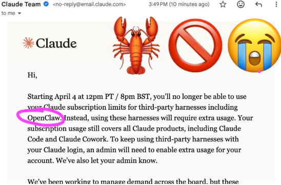

# Run OpenClaw on Ollama (MiniMax-M2)

> **TL;DR:** Anthropic just cut third-party support. Your OpenClaw doesn't have to die.
>
> Switch to MiniMax-M2:cloud on Ollama — keeps 90% of capabilities, stays alive.

---

## The Problem

Anthropic terminated third-party API access. If you're running OpenClaw with Claude as your only model, your automations just stopped.

## The Solution: MiniMax-M2 via Ollama

MiniMax-M2 is a 32B parameter model from MiniMax, optimized for coding and agentic workflows. It:

- ✅ **Beats Claude Sonnet 4** on Terminal-Bench (46.3 vs 36.4) and BrowseComp (44 vs 12.2)
- ✅ **Runs on Ollama** — no more API dependency
- ✅ **Handles 90% of automation tasks** indistinguishably from Claude

## Setup (Updated for Latest OpenClaw)

### 1. Install Ollama

```bash
winget install Ollama.Ollama
```

### 2. Sign up for Ollama Pro/Max

Sign in at https://ollama.com/signin

### 3. The Easy Way — Use Onboarding

```bash
openclaw onboard
```

Select **Ollama** → **Cloud + Local** → pick `minimax-m2.5:cloud`

Or non-interactive:

```bash
openclaw onboard --non-interactive \
  --auth-choice ollama \
  --custom-model-id "minimax-m2.5:cloud" \
  --accept-risk
```

### 4. The Manual Way

If you prefer manual config, here's the updated setup:

```json5
{
  models: {
    providers: {
      ollama: {
        // ⚠️ Use NATIVE API, NOT /v1 (tool calling breaks with /v1)
        baseUrl: "http://127.0.0.1:11434",
        apiKey: "ollama-local",
        api: "ollama",
        models: [
          {
            id: "minimax-m2.5:cloud",
            name: "MiniMax M2.5 Cloud",
            reasoning: true,
            input: ["text"],
            cost: { input: 0, output: 0, cacheRead: 0, cacheWrite: 0 }
          }
        ]
      }
    }
  },
  agents: {
    defaults: {
      model: {
        primary: "ollama/minimax-m2.5:cloud",
        fallbacks: [
          "ollama/qwen3-coder:480b-cloud",
          "ollama/gpt-oss:120b-cloud",
          "ollama/glm-4.6:cloud"
        ]
      }
    }
  }
}
```

**⚠️ Critical:** Use `baseUrl: "http://127.0.0.1:11434"` — NOT `http://127.0.0.1:11434/v1`. The `/v1` path uses OpenAI-compatible mode where tool calling is unreliable.

### 5. Restart OpenClaw

```bash
openclaw gateway restart
```

## Verify It Works

```bash
openclaw models list
```

You should see `minimax-m2.5:cloud` in the list.

## Auto-Discovery (Even Simpler!)

If you just set the environment variable without explicit model config, OpenClaw auto-discovers your Ollama models:

```bash
export OLLAMA_API_KEY="ollama-local"
```

Then in config (no explicit models needed):

```json5
{
  agents: {
    defaults: {
      model: {
        primary: "ollama/minimax-m2.5:cloud"
      }
    }
  }
}
```

## Why This Matters

| Aspect | Claude API | MiniMax-M2 via Ollama |
|--------|-----------|----------------------|
| Reliability | Can revoke access | Yours forever |
| Tool calling | ✅ | ✅ |
| Benchmark performance | Reference | Beats on agentic tasks |
| Cost | Pay-per-token | Subscription (predictable) |
| Availability | Rate limited | Always-on |

## Benchmarks

| Benchmark | MiniMax-M2 | Claude Sonnet 4 |
|-----------|------------|----------------|
| Terminal-Bench | **46.3** | 36.4 |
| BrowseComp | **44** | 12.2 |
| GAIA (text) | **75.7** | 68.3 |
| AA Intelligence | **61** | 57 |

---

**Links:**
- MiniMax-M2.5: https://ollama.com/library/minimax-m2
- Ollama: https://ollama.com
- Ollama Pricing: https://ollama.com/pricing
- OpenClaw Docs: https://docs.openclaw.ai

---
